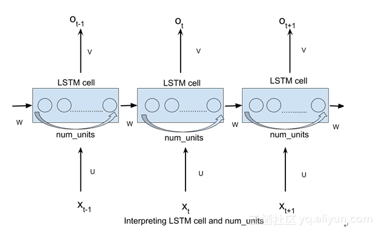
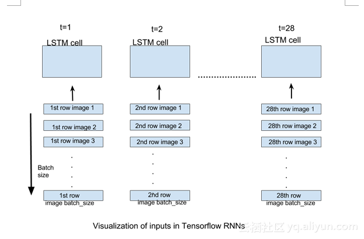

# Recurrent Neural Network 学习笔记1
### Author：sy.liu
### Contact Me:liu.sy.chn@hotmail.com
## 引言
在Recurrent Neural Network的学习过程中，在完成基本数学原理的推导后，我们会使用深度学习框架进行实现。而现有的资料对于这两者的结合并不是很多，故写下此笔记心得，帮助自己或他人更快地理解。
## 基本原理
图1-1展示了一个最基本的循环神经网络单元，我们可以很清晰的看到其循环计算操作。

图1-1 循环神经网络基本单元

当我们在时间上展开后，可得到图1-2

图1-2 标准循环单元在时间上展开 

通过以上分析，应明确一点：循环神经网络在网络构件上其实非常简单，只需定义若干个循环单元即可，而并不需要自行构建神经元节点。一个循环单元在时间上展开便可构建一层网络。如果需要构建深层循环神经网络，定义多个循环单元即可。  

## Tensorflow实现
  
在Tesnsorflow中，我们可使用一些基本的函数构建基本循环单元。笔者由于只使用了LSTM单元的相关函数，故只列举LSTM的部分使用方法。标准循环单元或GRU均相同。  
实际上，在每个循环单元内部，又存在多个隐藏节点，如图1-3所示。

图1-3 标准循环单元内部结构 

以下是tensorflow1.0版本中对tf.contrib.rnn.BasicLSTMCell()函数的定义：  
<pre><code>
class BasicLSTMCell(RNNCell):
  """Basic LSTM recurrent network cell.

  The implementation is based on: http://arxiv.org/abs/1409.2329.

  We add forget_bias (default: 1) to the biases of the forget gate in order to
  reduce the scale of forgetting in the beginning of the training.

  It does not allow cell clipping, a projection layer, and does not
  use peep-hole connections: it is the basic baseline.

  For advanced models, please use the full @{tf.nn.rnn_cell.LSTMCell}
  that follows.
  """

  def __init__(self, num_units, forget_bias=1.0,
               state_is_tuple=True, activation=None, reuse=None):
    """Initialize the basic LSTM cell.

    Args:
      num_units: int, The number of units in the LSTM cell.
      forget_bias: float, The bias added to forget gates (see above).
        Must set to `0.0` manually when restoring from CudnnLSTM-trained
        checkpoints.
      state_is_tuple: If True, accepted and returned states are 2-tuples of
        the `c_state` and `m_state`.  If False, they are concatenated
        along the column axis.  The latter behavior will soon be deprecated.
      activation: Activation function of the inner states.  Default: `tanh`.
      reuse: (optional) Python boolean describing whether to reuse variables
        in an existing scope.  If not `True`, and the existing scope already has
        the given variables, an error is raised.

      When restoring from CudnnLSTM-trained checkpoints, must use
      CudnnCompatibleLSTMCell instead.
    """
    super(BasicLSTMCell, self).__init__(_reuse=reuse)
    if not state_is_tuple:
      logging.warn("%s: Using a concatenated state is slower and will soon be "
                   "deprecated.  Use state_is_tuple=True.", self)
    self._num_units = num_units
    self._forget_bias = forget_bias
    self._state_is_tuple = state_is_tuple
    self._activation = activation or math_ops.tanh
    self._linear = None

  @property
  def state_size(self):
    return (LSTMStateTuple(self._num_units, self._num_units)
            if self._state_is_tuple else 2 * self._num_units)

  @property
  def output_size(self):
    return self._num_units

  def call(self, inputs, state):
    """Long short-term memory cell (LSTM).

    Args:
      inputs: `2-D` tensor with shape `[batch_size x input_size]`.
      state: An `LSTMStateTuple` of state tensors, each shaped
        `[batch_size x self.state_size]`, if `state_is_tuple` has been set to
        `True`.  Otherwise, a `Tensor` shaped
        `[batch_size x 2 * self.state_size]`.

    Returns:
      A pair containing the new hidden state, and the new state (either a
        `LSTMStateTuple` or a concatenated state, depending on
        `state_is_tuple`).
    """
    sigmoid = math_ops.sigmoid
    # Parameters of gates are concatenated into one multiply for efficiency.
    if self._state_is_tuple:
      c, h = state
    else:
      c, h = array_ops.split(value=state, num_or_size_splits=2, axis=1)

    if self._linear is None:
      self._linear = _Linear([inputs, h], 4 * self._num_units, True)
    # i = input_gate, j = new_input, f = forget_gate, o = output_gate
    i, j, f, o = array_ops.split(
        value=self._linear([inputs, h]), num_or_size_splits=4, axis=1)

    new_c = (
        c * sigmoid(f + self._forget_bias) + sigmoid(i) * self._activation(j))
    new_h = self._activation(new_c) * sigmoid(o)

    if self._state_is_tuple:
      new_state = LSTMStateTuple(new_c, new_h)
    else:
      new_state = array_ops.concat([new_c, new_h], 1)
    return new_h, new_state
</code></pre>
根据以上的定义，可知rnn\_unit参数无默认值，故我们在初始化BasicLSTMCell时必须传入参数，而这个其实就是图1-3中的rnn\_unit。  
我们输入的数据最终会变换为[batch\_size,time\_step,rnn\_unit]，那么这些数据是如何对应输入网络的呢？图1-4给出了计算过程。  

图1-4 LSTM网络计算过程 

  
Recurrent网络按时间展开的步数由我们输入的time\_step决定，所有时间步内的权值共享。在每个时刻下，每个标准的LSTM单元都会产生一个结果，所以输出该网络的矩阵大小与输入完全相同。根据不同的需要，我们可以对输出矩阵做相应的变换，或只取最后一个值作为输出。  

## 循环单元rnn_unit取值的问题
  
上一节我们看到了输入参数rnn\_unit可任意定义其大小而并不会影响计算过程，那么接下来出现了一个新的问题，rnn\_unit究竟该如何取值呢？  
首先，在数据集输入到网络中时，都会与输入权重矩阵相乘进行变换。其定义如下：
<pre><code>
input_weight = tf.Variable(tf.random_noral([input_size,rnn_unit]))
</code></pre>
故输入数据的shape并不会决定rnn\_unit的大小。在此。我们认为rnn_unit的选择应依据数据集而定。如果需要提取或抽象的信息较大，需要表征较为复杂的特征，则应适当提高rnn\_unit单元的数量。但应注意过分的提高rnn\_unit数量会出现过拟合的问题。  
相关参数的选择可参考博客：- [http://blog.csdn.net/wangyao_bupt/article/details/71273516](http://blog.csdn.net/wangyao_bupt/article/details/71273516) 
